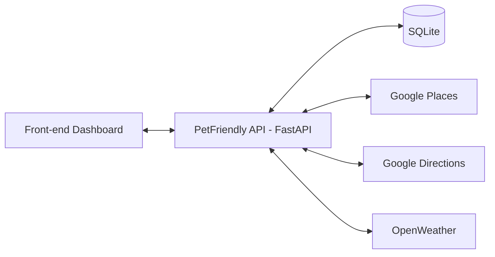
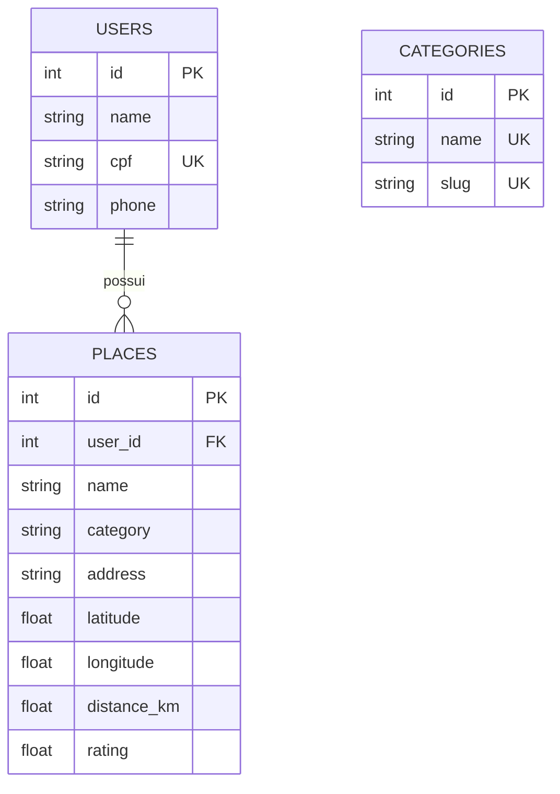
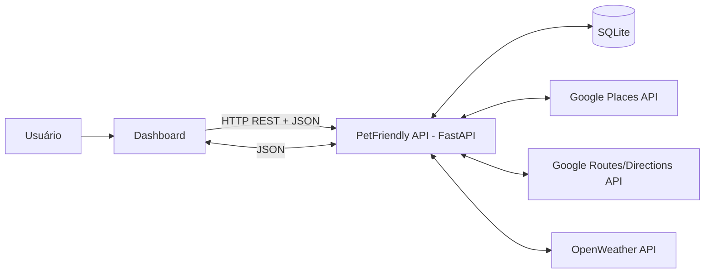
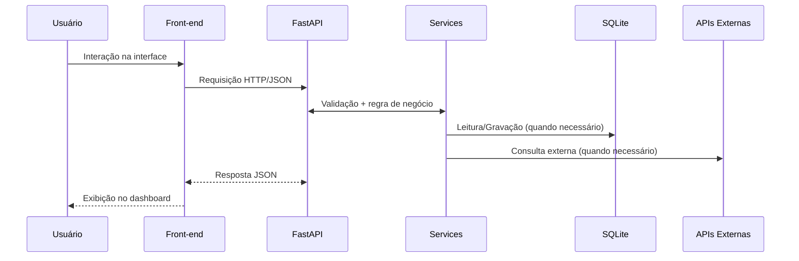

# PetFriendly MVP

Este projeto é um sistema para busca de lugares pet-friendly, incluindo parques, praças e estabelecimentos, com funcionalidades de cálculo de distância e rotas. O sistema é dividido em duas partes principais: a API (Back-End) e o Dashboard (Front-End).

### Front-End funcional
localfile://path?assets/17738809663888.jpg

### Mockup gráfico elaborado por mim como base para a página web 


# PetFriendly API 🐾

API REST desenvolvida em **FastAPI** para busca de locais pet friendly, cálculo de rota, clima em tempo real e gestão de favoritos por usuário.

---

## 📋 Índice
1. [Objetivo](#objetivo)
2. [Estrutura do Projeto](#estrutura-do-projeto)
3. [Arquitetura](#arquitetura)
4. [Instalação](#instalação)
5. [Execução com Docker](#execução-com-docker)
6. [Uso da API](#uso-da-api)
7. [Banco de Dados](#banco-de-dados)
8. [Documentação](#documentação)

---

## 🎯 Objetivo

Esta API implementa o **back-end do MVP PetFriendly** (Cenário 1.1 da disciplina).

Funcionalidades:
- ✅ Busca de locais pet friendly (Google Places)
- ✅ Cálculo de rota (Google Directions)
- ✅ Consulta de clima (OpenWeather)
- ✅ Categorias de filtro
- ✅ Easy Login (criar/atualizar usuário)
- ✅ Gestão de favoritos por usuário
- ✅ Persistência em SQLite

---

## 📁 Estrutura do Projeto

```text
petfriendly-api/
├── app/
│   ├── config/
│   │   └── settings.py              # Carregamento de variáveis de ambiente (.env)
│   ├── database/
│   │   ├── database.py              # Configuração SQLAlchemy e SessionLocal
│   │   └── seed.py                  # Seed inicial de categorias
│   ├── models/
│   │   ├── category.py              # ORM: tabela de categorias
│   │   ├── user.py                  # ORM: tabela de usuários
│   │   └── place.py                 # ORM: tabela de favoritos
│   ├── routes/
│   │   ├── categories.py            # GET /categories/
│   │   ├── users.py                 # POST /users/easy-login
│   │   ├── places.py                # CRUD de favoritos + search/route
│   │   └── weather.py               # GET /weather/?city=...
│   ├── schemas/
│   │   ├── category_schema.py       # Validação Pydantic: categorias
│   │   ├── user_schema.py           # Validação Pydantic: usuários
│   │   └── place_schema.py          # Validação Pydantic: favoritos
│   ├── services/
│   │   └── google_places.py         # Integração Google Places + Directions
│   └── main.py                      # FastAPI app, CORS, rotas, seed
├── Dockerfile                        # Imagem Docker da API
├── docker-compose.yml               # Orquestração local
├── requirements.txt                 # Dependências Python
├── .env.example                     # Template de variáveis de ambiente
├── .gitignore                       # Git ignore
└── README.md                        # Este arquivo
```

### Descrição dos diretórios

| Diretório | Função |
|-----------|--------|
| `app/config/` | Carrega chaves da API (Google, OpenWeather) do `.env` |
| `app/database/` | Setup do SQLite, SessionLocal e seed de categorias padrão |
| `app/models/` | ORM SQLAlchemy (estrutura das tabelas) |
| `app/routes/` | Endpoints HTTP (FastAPI routers) |
| `app/schemas/` | Validação de entrada/saída com Pydantic |
| `app/services/` | Lógica de consumo de APIs externas |

---

## 🏗️ Arquitetura



### Banco de Dados (DER)



---

## 💾 Instalação passo-a-passo

### Pré-requisitos
- **Python 3.11+**
- **Git**
- **Docker** (opcional, para executar em container)

### Passo 1: Clonar o repositório - Importante sem usar o docker, ou usando o docker
```bash
git clone https://github.com/SEU_USUARIO/petfriendly-api.git
cd petfriendly-api
```


### Passo 2: Criar ambiente virtual (sem o Docker)
```bash
python3 -m venv .venv
source .venv/bin/activate  # macOS/Linux
# ou
.venv\Scripts\activate     # Windows
```

### Passo 3: Instalar dependências
```bash
pip install --upgrade pip
pip install -r requirements.txt
```

### Passo 4: Configurar variáveis de ambiente
Criar arquivo `.env` na raiz:

```env
GOOGLE_API_KEY=sua_chave_google_aqui
OPENWEATHER_API_KEY=sua_chave_openweather_aqui
```

**Como obter as chaves:**
 - Para os professores vou enviar as chaves separadamente na mensagem anexada ao projeto

- **Google API Key**: https://console.cloud.google.com  
  (ativar Google Places API + Google Directions API)
- **OpenWeather API Key**: https://openweathermap.org/api

### Passo 5: Executar a API (sem Docker)
```bash
uvicorn app.main:app --reload --host 127.0.0.1 --port 8000
```

Abrir no navegador:
- `http://127.0.0.1:8000/docs` (Swagger interativo)
- `http://127.0.0.1:8000/health` (verificar se está online)

---

## 🐳 Execução com Docker para o API - (recomendado) testado e funciona
### Rodar com docker-compose (recomendado)
#### Antes de usar o docker-compose -> Configurar variáveis de ambiente no diretorio clonado
 - Para os professores vou enviar as chaves separadamente na mensagem anexada ao projeto

Criar arquivo `.env` na raiz:

```env
GOOGLE_API_KEY=sua_chave_google_aqui
OPENWEATHER_API_KEY=sua_chave_openweather_aqui
```


```bash - terminal
1 - git clone https://github.com/Elainecbr/petfriendly-api.git
2 - cd petfriendly-api
3 - docker compose up --build
```
----

### Build da imagem
```bash
docker build -t petfriendly-api:latest .
```

### Rodar container (sem docker-compose)
```bash
docker run --rm -p 8000:8000 --env-file .env petfriendly-api:latest
```

### Rodar com docker-compose (recomendado)
```bash
docker compose up --build
```

### Abrir swagger:

- `http://127.0.0.1:8000/docs`


### Parar container
```bash
docker compose down
```

---

## 🔌 Uso da API - testes  no localhost - no navegador

### Health Check
```bash
curl http://127.0.0.1:8000/health
```
no navegador  http://127.0.0.1:8000/health

Resposta:
```json
{"status": "ok"}
```


### 1. Listar categorias
```bash
curl http://127.0.0.1:8000/categories/
```
no navegador http://127.0.0.1:8000/categories/


### 2. Buscar locais pet friendly
```bash
curl "http://127.0.0.1:8000/places/search?location=Copacabana&keyword=pet+friendly&radius=3000"
```
no navegador [http://127.0.0.1:8000/categories/](http://127.0.0.1:8000/places/search?location=Copacabana&keyword=pet+friendly&radius=3000)


 
### 3. Calcular rota
```bash
curl "http://127.0.0.1:8000/places/route?origin=Copacabana&destination=Dog's+Beach+Club&mode=walking"
no navegador http://127.0.0.1:8000/places/route?origin=Copacabana&destination=Dog's+Beach+Club&mode=walking

```

### 4. Easy Login (criar/atualizar usuário)
```bash
curl -X POST "http://127.0.0.1:8000/users/easy-login" \
  -H "Content-Type: application/json" \
  -d '{
    "name": "Elaine",
    "cpf": "123.456.789-00",
    "phone": "(21) 99999-9999"
  }'
```

Resposta:
```json
{
  "id": 1,
  "name": "Elaine",
  "cpf": "123.456.789-00",
  "phone": "(21) 99999-9999"
}
```

### 5. Salvar favorito
```bash
curl -X POST "http://127.0.0.1:8000/places/favorites?user_id=1" \
  -H "Content-Type: application/json" \
  -d '{
    "name": "Dogs Beach Club",
    "category": "parque",
    "address": "R. Carlos Galhardo, 70 - Recreio dos Bandeirantes, Rio de Janeiro",
    "latitude": -23.0,
    "longitude": -43.5,
    "rating": 4.9
  }'
```

### 6. Listar favoritos do usuário
```bash
curl "http://127.0.0.1:8000/places/favorites?user_id=1"
```

### 7. Clima
```bash
curl "http://127.0.0.1:8000/weather/?city=Rio de Janeiro"
```

---

## 💾 Banco de Dados

O arquivo `petfriendly.db` é criado automaticamente na raiz ao iniciar a API.

### Resetar banco (apagar dados)
```bash
rm petfriendly.db
```

Na próxima inicialização, as tabelas e categorias padrão serão recriadas.

---

## 📖 Documentação

### Swagger UI (interativo)
Acesse: `http://127.0.0.1:8000/docs`

Aqui você pode:
- Ver todos os endpoints
- Testar diretamente no navegador
- Ver schemas de entrada/saída

### ReDoc (leitura)
Acesse: `http://127.0.0.1:8000/redoc`

---

## 🛠️ Tecnologias

| Tecnologia | Versão | Função |
|-----------|--------|--------|
| FastAPI | 0.115.0 | Framework HTTP |
| Uvicorn | 0.30.6 | ASGI server |
| SQLAlchemy | 2.0.35 | ORM |
| Pydantic | 2.9.2 | Validação |
| Requests | 2.32.3 | HTTP client |
| Python-dotenv | 1.0.1 | Variáveis de ambiente |

---

## 📝 Comentários no código

Todos os arquivos estão comentados com:
- **Responsabilidades** de cada módulo
- **Propósito** de cada função/classe
- **Integração** no sistema geral

Exemplo de comentário:
```python
"""
Faz a busca principal de locais.

Fluxo:
1. lê a localização digitada;
2. converte CEP para endereço quando necessário;
3. chama /places/search;
4. salva os resultados em memória;
5. renderiza a lista;
"""
```

---
<!-- ...existing code... -->

## 👩‍🏫 Guia rápido para correção (Professor)

### Pré-requisitos
- Docker Desktop instalado e em execução.
- Git instalado.

### Passo a passo (API)
1. Clonar o repositório:
   ```bash
   git clone https://github.com/Elainecbr/petfriendly-api.git
   cd petfriendly-api
   ```

2. Criar o arquivo `.env`:
   ```bash
   cp .env.example .env
   ```

3. Preencher as chaves no `.env`:
   - `GOOGLE_API_KEY=...`
   - `OPENWEATHER_API_KEY=...`

4. Subir com Docker:
   ```bash
   docker compose up --build
   ```

5. Acessar no navegador:
   - Swagger: `http://127.0.0.1:8000/docs`
   - Health: `http://127.0.0.1:8000/health`

### Observações
- Não é necessário criar `venv` para executar via Docker.
- Para encerrar:
  ```bash
  docker compose down
  ```

  <!-- ...existing code... -->

## Arquitetura e Estratégia de Comunicação

O projeto segue arquitetura **cliente-servidor**:

- **Dashboard (Front-end)**: interface web.
- **PetFriendly API (Back-end)**: FastAPI com organização modular (`routes`, `services`, `models`, `schemas`).
- **Banco local**: SQLite (`petfriendly.db`).

A comunicação é feita por **REST sobre HTTP com JSON**, no modelo **síncrono request-response**.  
O contrato da API é documentado automaticamente por **OpenAPI/Swagger** (`/docs`).



### Fluxo de execução

1. Usuário interage no dashboard.  
2. Front-end envia requisição para a API.  
3. API valida dados com Pydantic.  
4. API executa regras de negócio na camada de services.  
5. API consulta SQLite e/ou APIs externas.  
6. API retorna JSON para o front-end renderizar resultados.



### APIs externas utilizadas

- **Google Places API**: busca de locais pet friendly.
- **Google Routes/Directions API**: cálculo de rotas (distância, duração e modo).
- **OpenWeather API**: clima (temperatura, chuva e umidade).

<!-- ...existing code... -->

<!-- ...existing code... -->

## 🚀 Pronto para entrega

- ✅ Dockerfile na raiz
- ✅ docker-compose.yml na raiz
- ✅ .env.example com template - modelo como base para Criar arquivo `.env` na raiz 
- ✅ Todos os arquivos comentados
- ✅ DER em Mermaid
- ✅ README completo
- ✅ Executável via Docker
